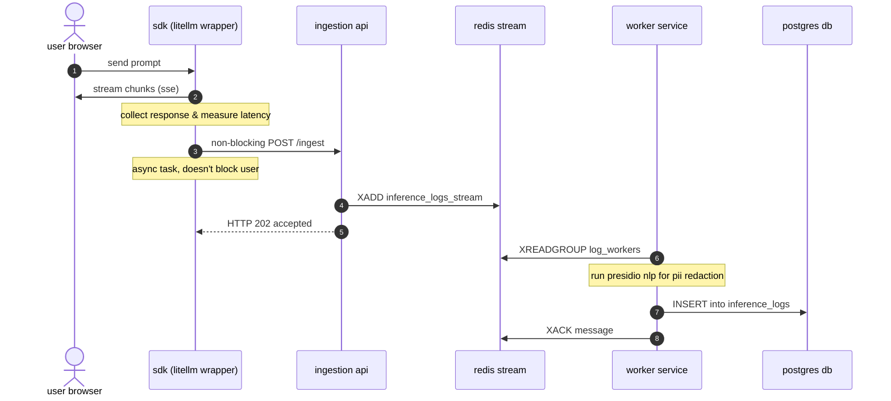

# architecture notes for heimdall

here is a detailed look at how heimdall handles the telemetry pipeline from llm completion streams to postgresql storage.

## the telemetry pipeline

### how it works:
1. **sdk intercepts**: `llmobservabilitysdk` wraps `litellm.acompletion` via python async generator. it starts a stopwatch (`request_timestamp`).
2. **chunk harvesting**: as the user reads the response, the sdk silently records all chunks in memory.
3. **math class**: when streaming finishes, we stop the timer (`latency_ms`) and count tokens using `litellm.token_counter`. if it's an unrecognized model, we fall back to `len // 4`.
4. **background async dispatch**: sdk schedules a post request to `/ingest` using python's `asyncio.create_task()`. this means it's sent out-of-band and the user's browser isn't waiting on telemetry writes.
5. **ingest buffer**: fastapi gets the payload, formats dates and does an `xadd` to write it directly to the redis stream `inference_logs_stream` as strings.
6. **worker loops**: worker service uses `xreadgroup` to fetch batches of 10 messages.
7. **pii scrubbing**: the worker runs microsoft presidio to censor names/emails/phones so we don't save sensitive data to disk.
8. **database save**: worker inserts the clean log into postgresql and does an `xack` to tell redis the message is processed.

## logging strategy
we keep it simple. writing directly to the db from the chat api creates blocked connections under high load. using redis as a buffer ensures the app stays responsive. we capture:
* tokens, latency, status (success/error), timestamps and redacted text previews.

## scaling considerations
* **ingestion api**: it's stateless. spin up instances behind an alb to handle higher log write volumes.
* **redis stream**: operates in ram. we limit maximum length (`maxlen`) so it doesn't consume all system memory.
* **workers**: redis consumer groups make it easy to scale workers. we can run multiple worker containers. redis automatically splits the stream among them. since pii redaction is cpu-heavy (nlp models), scaling workers is essential.
* **postgres**: b-tree indexes on `created_at` and `status` keep dashboard charts rendering fast. if logs grow too big, we should partition by month.

## failure scenarios
* **ingest service goes down**: sdk catches http error, logs it to console and moves on. logs are lost, but chat keeps working. user experience remains the top priority.
* **redis dies**: ingest api returns 500. sdk ignores it, chat keeps working.
* **db dies**: workers fail to insert. workers catch the database exception and sleep for 1 second, then try again. the logs sit safely in the redis stream. once the database is back up, the worker resumes right where it left off.
* **pii engine fails**: if presidio breaks, we catch the exception and log the original unredacted text instead of crashing the pipeline. availability takes priority over privacy in an emergency.
