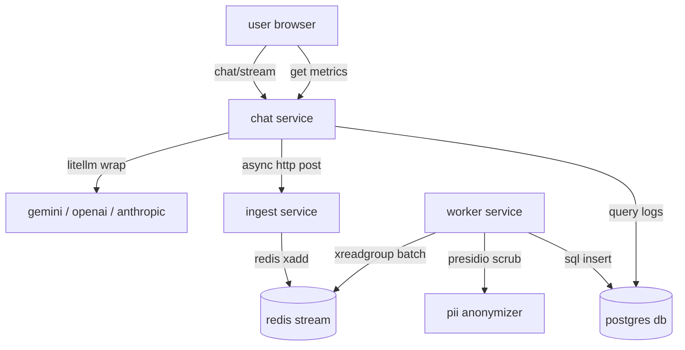

# heimdall

a lightweight, async telemetry wrapper for llm calls that redacts pii and feeds a dashboard in the background.

## architecture overview

here is how the data flows through the system:



## features
* **universal sdk wrapper**: uses `litellm` inside. gemini, openai, anthropic, deepseek... it just works.
* **zero lag telemetry**: logs are sent out-of-band via python `asyncio` tasks. your chat stream doesn't wait for telemetry. 
* **event-driven speed**: ingest api dumps payload directly to redis streams and returns immediately. no database bottlenecks.
* **pii redaction**: background worker uses microsoft presidio to clean sensitive text (names, emails, phones) before saving to postgres.
* **bento dashboard**: next.js ui showing avg latency, token counts and live logs with nice micro-animations.


## setup

### prerequisites
* docker and docker compose.

### running it
1. clone the repo.
2. throw your api keys into `docker-compose.yml` under `chat-service` env variables.
3. spin up the stack:
   ```bash
   docker compose up --build -d
   ```
4. open these:
   * **dashboard & chat**: `http://localhost:3000`
   * **chat service backend**: `http://localhost:8000`
   * **ingest service backend**: `http://localhost:8001`


## database schema design

we use postgres. the schema is structured so logging doesn't mess with user history:

* **`conversations`**: stores user chat sessions.
* **`messages`**: stores actual chat messages (user prompt + model response). cascades on delete.
* **`inference_logs`**: stores sdk telemetry. references conversations/messages but uses `on delete set null`. 
  * **why?** if a user deletes their chat history, the logs stay in the db for system metrics. we keep the telemetry, they get their data deleted.
  * **indexes**: b-tree indexes on `created_at` (for fast time charts) and `status` (for tracking errors).


## tradeoffs

* **http transport**: sdk posts to ingestion api instead of writing directly to redis. this adds network hops but keeps the sdk tiny and secure.
* **presidio lag**: pii redaction is cpu-heavy. we put it in the background worker so the web server doesn't freeze up under load.
* **token counts**: we count tokens using `litellm.token_counter`. if it fails or doesn't know the model, we fall back to `text_len // 4` to prevent crashes.


## future improvements

1. **sdk retry**: right now if the ingestion api dies, the sdk just prints an error and drops the log. we should add an in-memory queue to retry with backoff.
2. **timescaledb**: postgres performance will degrade once we hit millions of logs. we need table partitioning or timescale to keep aggregations fast.
3. **dead letter queue**: if the worker fails to parse a bad log, it retries forever. we need to dump bad logs to a side queue.
4. **sampling**: we should only log a portion of successful calls to save database space, but keep all errors.
